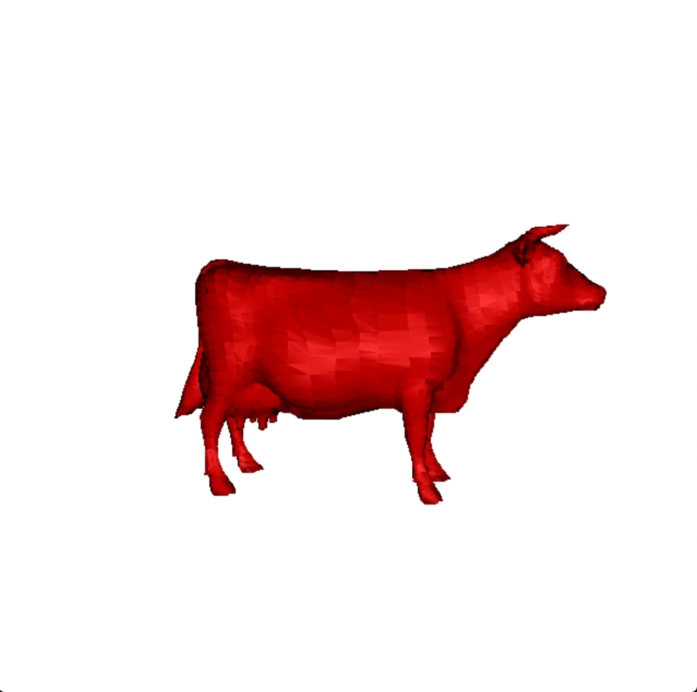
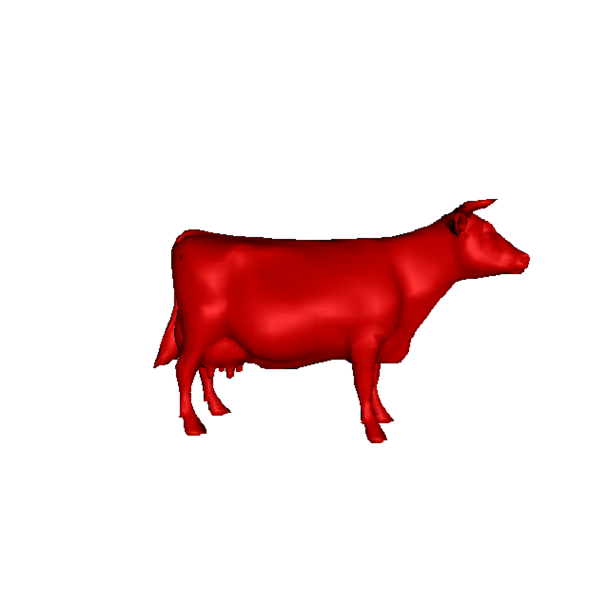
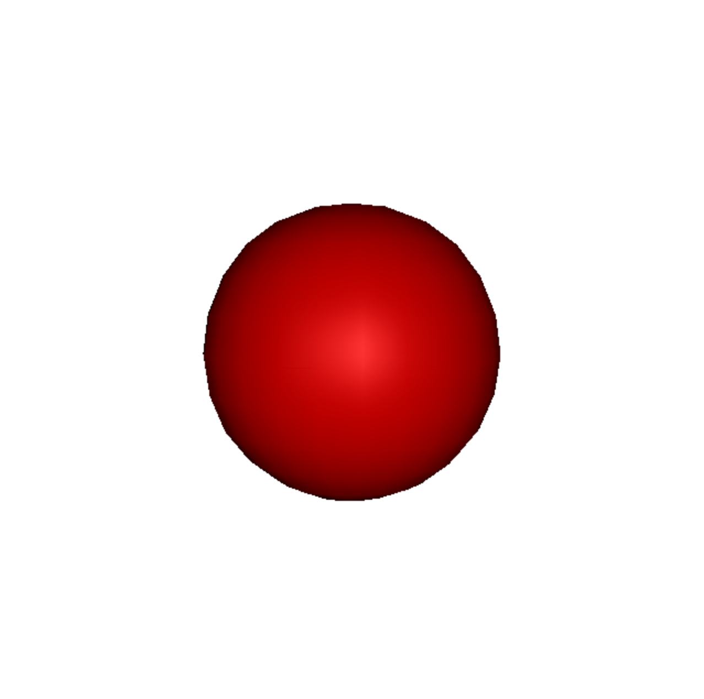
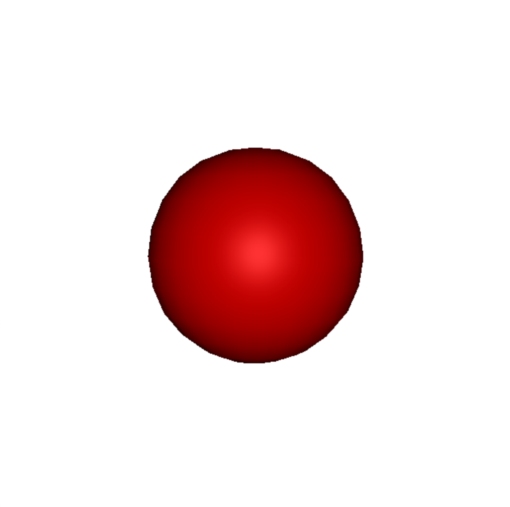

# Render
In the Constant shading, only vertex normals are used to calculate vertex colors. In
the Gouraud shading, the color is calculated at each vertex and then interpolated along
the edge. In the Phong shading, vertex normals are interpolate

                            `Constant Shading Model`

                            `Gouraud Shading Model`

                            `Phong Shading Model`

<table><tr>
    <td >
        
  Gourand Shading 

    </td>
    <td >
        
Phong Shading

    </td>
</tr></table>

